# CaseCrux: AI-Powered Question Answering with Amazon Bedrock

CaseCrux is a Streamlit-based web application that leverages Amazon Bedrock to provide intelligent question-answering capabilities. It enables users to ask questions and receive contextually relevant answers powered by advanced language models, with source attribution and context visualization.

The application uses a serverless architecture with AWS Lambda functions and API Gateway to interact with Amazon Bedrock's knowledge base system. The frontend provides a chat-like interface while the backend handles knowledge base queries and automatic synchronization of new content.

## Repository Structure
```
.
├── app.py                        # Streamlit frontend application
├── primary_lambda_function.py    # Main Lambda function for Bedrock interaction
├── autosync_lambda_function.py   # Lambda function for KB auto-synchronization
├── AWS_Architecture_Diagram.md   # Detailed AWS architecture documentation
├── CaseCrux_Hackathon_Article.md # Project overview and implementation details
├── requirements.txt              # Python package dependencies
└── run.py                       # Legacy entry point (deprecated)
```
## Detailed Architecture Flow

```mermaid
graph TB
    %% User Interface Layer
    User[👤 Legal Practitioner] --> Domain[🌐 Custom Domain<br/>Route 53]
    Domain --> Streamlit[🖥️ Streamlit Frontend<br/>CaseCrux Interface]
    
    %% API Layer
    Streamlit --> APIGW[🚪 API Gateway<br/>REST Endpoint<br/>v98yls4aeg.execute-api.us-east-1.amazonaws.com]
    
    %% Core Processing Layer
    APIGW --> Lambda1[⚡ AWS Lambda Function<br/>Query Processing Engine<br/>• Request Orchestration<br/>• Bedrock Integration<br/>• Response Formatting]
    
    %% AI & Knowledge Layer
    Lambda1 --> Bedrock[🧠 Amazon Bedrock<br/>LLM Service<br/>• Natural Language Processing<br/>• Intelligent Response Generation]
    Lambda1 --> KB[📚 Knowledge Base<br/>RAG System<br/>• Semantic Search<br/>• Context Retrieval]
    
    %% Vector Database Layer
    KB --> OpenSearch[🔍 Amazon OpenSearch<br/>Vector Database<br/>• Embedding Storage<br/>• Similarity Search<br/>• Fast Retrieval]
    
    %% Document Storage Layer
    KB --> S3[📦 Amazon S3<br/>Document Repository<br/>• Legal Documents<br/>• Case Files<br/>• Precedents]
    
    %% Embedding Processing
    S3 --> Titan[🎯 Titan Embedding Model<br/>Text Vectorization<br/>• Document Processing<br/>• Vector Generation]
    Titan --> OpenSearch
    
    %% Auto-Sync System
    S3 --> S3Event[📡 S3 Object Update Event<br/>Automatic Trigger]
    S3Event --> Lambda2[⚡ AWS Lambda Function<br/>Auto-Sync Engine<br/>• Document Processing<br/>• Embedding Generation<br/>• Index Updates]
    Lambda2 --> Titan
    Lambda2 --> OpenSearch
    
    %% Monitoring & Security
    CloudWatch[📊 CloudWatch<br/>Monitoring & Logging] -.-> Lambda1
    CloudWatch -.-> Lambda2
    CloudWatch -.-> APIGW
    
    IAM[🔐 IAM Roles & Policies<br/>Security & Access Control] -.-> Lambda1
    IAM -.-> Lambda2
    IAM -.-> S3
    IAM -.-> OpenSearch
    
    %% Styling
    classDef userLayer fill:#e1f5fe,stroke:#01579b,stroke-width:2px
    classDef apiLayer fill:#f3e5f5,stroke:#4a148c,stroke-width:2px
    classDef computeLayer fill:#e8f5e8,stroke:#1b5e20,stroke-width:2px
    classDef aiLayer fill:#fff3e0,stroke:#e65100,stroke-width:2px
    classDef storageLayer fill:#fce4ec,stroke:#880e4f,stroke-width:2px
    classDef monitoringLayer fill:#f1f8e9,stroke:#33691e,stroke-width:2px
    
    class User,Domain,Streamlit userLayer
    class APIGW apiLayer
    class Lambda1,Lambda2 computeLayer
    class Bedrock,KB,Titan aiLayer
    class S3,OpenSearch storageLayer
    class CloudWatch,IAM monitoringLayer
```



## Data Flow Sequence


## Additional Documentation
- **AWS_Architecture_Diagram.md**: Contains detailed diagrams and explanations of the AWS serverless architecture used in the project
- **CaseCrux_Hackathon_Article.md**: Provides comprehensive information about the project's development, implementation details, and use cases

## Prerequisites
- Python 3.6 or higher
- AWS account with access to Amazon Bedrock service
- AWS credentials (Access Key and Secret Key)
- AWS region where Bedrock service is available

Required environment variables:
- AWS_ACCESS_KEY
- AWS_SECRET_KEY
- AWS_REGION

### Installation

1. Clone the repository:
```bash
git clone <repository-url>
cd casecrux
```

2. Create and activate a virtual environment:
```bash
# MacOS/Linux
python -m venv venv
source venv/bin/activate

# Windows
python -m venv venv
.\venv\Scripts\activate
```

3. Install required dependencies:
```bash
pip install -r requirements.txt
```

4. Create a `.env` file in the root directory with your AWS credentials:
```
AWS_ACCESS_KEY=your_access_key
AWS_SECRET_KEY=your_secret_key
AWS_REGION=your_aws_region
```

5. Configure API Gateway endpoint in app.py:
```python
API_URL = "your_api_gateway_endpoint"
```

### Quick Start

1. Start the application:
```bash
streamlit run app.py
```

2. Open your web browser and navigate to the URL displayed in the terminal (typically http://localhost:8501)

3. Enter your question in the chat input field and press Enter to receive an answer

### More Detailed Examples

1. Basic Question-Answer:
```python
# Enter a question in the chat input
question = "What is the capital of France?"
# The system will display the answer with relevant context and source
```

2. Clearing Chat History:
- Click the "Clear Chat History" button in the sidebar to reset the conversation

### Troubleshooting

Common Issues:

1. AWS Credentials Error
```
botocore.exceptions.NoCredentialsError: Unable to locate credentials
```
Solution:
- Verify your AWS credentials in the `.env` file
- Ensure the environment variables are properly loaded
- Check if your AWS credentials have the necessary permissions for Bedrock service

2. Streamlit Connection Issues
```
Connection error: Connection refused
```
Solution:
- Ensure no other application is using port 8501
- Try running streamlit with a different port:
```bash
streamlit run run.py --server.port 8502
```

3. Knowledge Base Response Issues
- If you receive "No Context" messages:
  * Verify that the knowledge base ID is correct
  * Ensure the question is relevant to the knowledge base content
  * Check if the Bedrock model ARN is correct and accessible

## Data Flow

The application follows a serverless architecture with the following data flow:

```ascii
User Input -> Streamlit UI -> API Gateway -> Primary Lambda -> Bedrock KB -> Response
                                                                   ^
S3 Upload -> EventBridge -> AutoSync Lambda --------------------- +
```

Key Component Interactions:
1. Frontend (app.py):
   - Handles user interface and chat history
   - Makes API calls to Lambda through API Gateway

2. Primary Lambda (primary_lambda_function.py):
   - Processes incoming questions
   - Interacts with Bedrock knowledge base
   - Returns formatted responses with context

3. AutoSync Lambda (autosync_lambda_function.py):
   - Triggered by S3 uploads
   - Initiates knowledge base synchronization
   - Ensures content is always up-to-date
