# CaseCrux AWS Architecture Diagram

## Detailed Architecture Flow

```mermaid
graph TB
    %% User Interface Layer
    User[👤 Legal Practitioner] --> Domain[🌐 Custom Domain<br/>Route 53]
    Domain --> Streamlit[🖥️ Streamlit Frontend<br/>CaseCrux Interface]
    
    %% API Layer
    Streamlit --> APIGW[🚪 API Gateway<br/>REST Endpoint<br/>v98yls4aeg.execute-api.us-east-1.amazonaws.com]
    
    %% Core Processing Layer
    APIGW --> Lambda1[⚡ AWS Lambda Function<br/>Query Processing Engine<br/>• Request Orchestration<br/>• Bedrock Integration<br/>• Response Formatting]
    
    %% AI & Knowledge Layer
    Lambda1 --> Bedrock[🧠 Amazon Bedrock<br/>LLM Service<br/>• Natural Language Processing<br/>• Intelligent Response Generation]
    Lambda1 --> KB[📚 Knowledge Base<br/>RAG System<br/>• Semantic Search<br/>• Context Retrieval]
    
    %% Vector Database Layer
    KB --> OpenSearch[🔍 Amazon OpenSearch<br/>Vector Database<br/>• Embedding Storage<br/>• Similarity Search<br/>• Fast Retrieval]
    
    %% Document Storage Layer
    KB --> S3[📦 Amazon S3<br/>Document Repository<br/>• Legal Documents<br/>• Case Files<br/>• Precedents]
    
    %% Embedding Processing
    S3 --> Titan[🎯 Titan Embedding Model<br/>Text Vectorization<br/>• Document Processing<br/>• Vector Generation]
    Titan --> OpenSearch
    
    %% Auto-Sync System
    S3 --> S3Event[📡 S3 Object Update Event<br/>Automatic Trigger]
    S3Event --> Lambda2[⚡ AWS Lambda Function<br/>Auto-Sync Engine<br/>• Document Processing<br/>• Embedding Generation<br/>• Index Updates]
    Lambda2 --> Titan
    Lambda2 --> OpenSearch
    
    %% Monitoring & Security
    CloudWatch[📊 CloudWatch<br/>Monitoring & Logging] -.-> Lambda1
    CloudWatch -.-> Lambda2
    CloudWatch -.-> APIGW
    
    IAM[🔐 IAM Roles & Policies<br/>Security & Access Control] -.-> Lambda1
    IAM -.-> Lambda2
    IAM -.-> S3
    IAM -.-> OpenSearch
    
    %% Styling
    classDef userLayer fill:#e1f5fe,stroke:#01579b,stroke-width:2px
    classDef apiLayer fill:#f3e5f5,stroke:#4a148c,stroke-width:2px
    classDef computeLayer fill:#e8f5e8,stroke:#1b5e20,stroke-width:2px
    classDef aiLayer fill:#fff3e0,stroke:#e65100,stroke-width:2px
    classDef storageLayer fill:#fce4ec,stroke:#880e4f,stroke-width:2px
    classDef monitoringLayer fill:#f1f8e9,stroke:#33691e,stroke-width:2px
    
    class User,Domain,Streamlit userLayer
    class APIGW apiLayer
    class Lambda1,Lambda2 computeLayer
    class Bedrock,KB,Titan aiLayer
    class S3,OpenSearch storageLayer
    class CloudWatch,IAM monitoringLayer
```

## Data Flow Sequence

## Component Details

### 🌐 **Frontend Layer**
- **Route 53**: Custom domain management and DNS routing
- **Streamlit**: Interactive web interface for legal practitioners
- **Features**: Chat interface, history management, source attribution

### 🚪 **API Layer**
- **API Gateway**: RESTful endpoint management
- **Security**: Request validation and rate limiting
- **Caching**: Response caching for improved performance

### ⚡ **Compute Layer (AWS Lambda)**
#### Primary Lambda Function
- **Runtime**: Python 3.9
- **Memory**: 1024 MB
- **Timeout**: 30 seconds
- **Concurrency**: 1000 concurrent executions

#### Auto-Sync Lambda Function
- **Runtime**: Python 3.9
- **Memory**: 512 MB
- **Timeout**: 5 minutes
- **Trigger**: S3 Object Created/Updated events

### 🧠 **AI & Intelligence Layer**
- **Amazon Bedrock**: Large Language Model service
- **Knowledge Base**: RAG (Retrieval-Augmented Generation) system
- **Titan Embedding**: Text vectorization for semantic search

### 🔍 **Data Layer**
- **Amazon S3**: Document storage with versioning
- **OpenSearch**: Vector database for similarity search
- **Indexing**: Real-time document indexing and retrieval

### 📊 **Monitoring & Security**
- **CloudWatch**: Comprehensive monitoring and logging
- **IAM**: Fine-grained access control and security policies
- **VPC**: Network isolation and security

## Performance Characteristics

| Component | Latency | Throughput | Scalability |
|-----------|---------|------------|-------------|
| API Gateway | < 10ms | 10,000 RPS | Auto-scaling |
| Lambda (Query) | < 500ms | 1000 concurrent | Auto-scaling |
| Lambda (Sync) | < 2s | Event-driven | Auto-scaling |
| OpenSearch | < 100ms | 1000 QPS | Horizontal scaling |
| S3 | < 50ms | Unlimited | Virtually unlimited |

## Cost Optimization Features

- **Lambda**: Pay-per-request pricing model
- **S3**: Intelligent tiering for cost optimization
- **OpenSearch**: Reserved instances for predictable workloads
- **API Gateway**: Caching to reduce backend calls
- **CloudWatch**: Cost monitoring and alerting

## Security Implementation

- **Encryption at Rest**: S3 and OpenSearch data encryption
- **Encryption in Transit**: HTTPS/TLS for all communications
- **IAM Policies**: Least privilege access control
- **API Authentication**: Secure endpoint access
- **VPC Integration**: Network-level security isolation

---

*This architecture demonstrates the power of AWS serverless computing in building intelligent, scalable, and cost-effective AI applications.*
